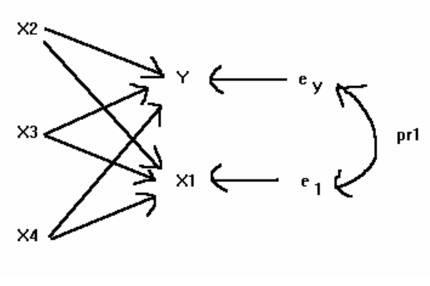

::: {.cell}

:::

::: {.cell}

:::

::: {.cell}

:::

::: {.cell}

:::


# Introdução

## Sobre a arte de comunicar {.smaller}

> Comunicação não é o que você fala, é o que o outro entende!

-   O Tratamento Científico trouxe **consistência** para a Engenharia de Avaliações

-   O Tratamento por Fatores, contudo, não deixou de ser utilizado

    -   Acredita-se que, em parte, isso se deve à clareza obtida com este tipo de tratamento

-   A consistência alcançada com o Tratamento Científico deu-se a custa de uma perda na clareza da comunicação

-   É possível conciliar?

    -   @upav2024, @valorem2024Augusto, @droubi2021, @Cerino2020, @trivelloni2005

-   Há outras vantagens, além da clareza, na utilização do tratamento por fatores?

## Cobb-Douglas {.smaller}

-   Função de Cobb-Douglas (forma mais simples):

-   $$Y = a.X^b$$

-   É possível linearizar a função de Cobb-Douglas:

-   $$\ln(Y) = \ln(a) + b.\ln(X)$$

-   O que torna fácil estimar a regressão:

-   $$\ln(Y) = \beta_0 + \beta_1.\ln(X) + \varepsilon$$

-   Uma vez estimado o modelo de regressão acima, pode-se obter $\hat a$ e $\hat b$:

-   $$\hat a = \exp(\hat \beta_0);\, \hat b = \hat\beta_1$$

-   A linearização está centrada na hipótese de que o erro é **multiplicativo**:

-   $\hat \varepsilon = \frac{Y}{\hat aX^\hat b}=\frac{Y}{\hat Y}$

## Cobb-Douglas (2) {.smaller}

-   A hipótese de que o erro é aditivo pode não ser verificada no mercado imobiliário:

. . .


::: {.cell}
::: {.cell-output-display}
{width=960}
:::
:::


## Cobb-Douglas (3) {.smaller}


::: {.cell}
::: {.cell-output-display}
{width=960}
:::
:::


-   A hipótese dos erros multiplicativos parece mais adequada!

## Cobb-Douglas (4) {.smaller}


::: {.cell}

:::

::: {.cell}
::: {.cell-output-display}
{width=960}
:::
:::


## Cobb-Douglas (5) {.smaller}


::: {.cell}
::: {.cell-output-display}
{width=960}
:::
:::


-   $a = \exp(10,4) \approx 32.860,00;\, b \approx -0,25$

-   $PU = 32.860,00.Area^{-0,25}$

## Cobb-Douglas (6) {.smaller}


::: {.cell}
::: {.cell-output-display}
{width=960}
:::
:::


-   $a = \exp(8,93) \approx 7.560,00;\, b \approx -0,25$

-   $PU = 7.560.\left (\frac{Area}{360} \right )^{-0,25} =  7.560.\left (\frac{360}{Area} \right )^{+0,25}$

# Dados de mercado

## Dados {.smaller}

-   Numa amostra de dados de mercado obtivemos:

-   30 dados de terrenos de variadas características

-   Algumas variáveis foram coletadas de forma incompleta, como a variável `Frente` e a variável `Incl` (inclinação da superfície do terreno).

. . .


::: {.cell}
::: {.cell-output-display}

`````{=html}
<table>
<caption>Summary Statistics</caption>
 <thead>
  <tr>
   <th style="text-align:left;"> Variable </th>
   <th style="text-align:left;"> N </th>
   <th style="text-align:left;"> Mean </th>
   <th style="text-align:left;"> Std. Dev. </th>
   <th style="text-align:left;"> Min </th>
   <th style="text-align:left;"> Pctl. 25 </th>
   <th style="text-align:left;"> Pctl. 50 </th>
   <th style="text-align:left;"> Pctl. 75 </th>
   <th style="text-align:left;"> Max </th>
  </tr>
 </thead>
<tbody>
  <tr>
   <td style="text-align:left;"> Area </td>
   <td style="text-align:left;"> 30 </td>
   <td style="text-align:left;"> 447 </td>
   <td style="text-align:left;"> 156 </td>
   <td style="text-align:left;"> 182 </td>
   <td style="text-align:left;"> 321 </td>
   <td style="text-align:left;"> 441 </td>
   <td style="text-align:left;"> 553 </td>
   <td style="text-align:left;"> 756 </td>
  </tr>
  <tr>
   <td style="text-align:left;"> Frente </td>
   <td style="text-align:left;"> 25 </td>
   <td style="text-align:left;"> 15 </td>
   <td style="text-align:left;"> 3.6 </td>
   <td style="text-align:left;"> 7.6 </td>
   <td style="text-align:left;"> 12 </td>
   <td style="text-align:left;"> 15 </td>
   <td style="text-align:left;"> 17 </td>
   <td style="text-align:left;"> 23 </td>
  </tr>
  <tr>
   <td style="text-align:left;"> Incl </td>
   <td style="text-align:left;"> 20 </td>
   <td style="text-align:left;"> 4 </td>
   <td style="text-align:left;"> 3 </td>
   <td style="text-align:left;"> 0.66 </td>
   <td style="text-align:left;"> 2.2 </td>
   <td style="text-align:left;"> 2.9 </td>
   <td style="text-align:left;"> 4.7 </td>
   <td style="text-align:left;"> 12 </td>
  </tr>
  <tr>
   <td style="text-align:left;"> PU </td>
   <td style="text-align:left;"> 30 </td>
   <td style="text-align:left;"> 2499 </td>
   <td style="text-align:left;"> 246 </td>
   <td style="text-align:left;"> 2038 </td>
   <td style="text-align:left;"> 2336 </td>
   <td style="text-align:left;"> 2463 </td>
   <td style="text-align:left;"> 2664 </td>
   <td style="text-align:left;"> 2900 </td>
  </tr>
</tbody>
</table>

`````

:::
:::


-   Nota-se que existem apenas 25 dados com a variável `Frente`.
-   E que existem apenas 20 dados com a variável `Incl`.

## Modelo de Regressão Múltipla {.smaller}

### Apenas casos completos


::: {.cell}
::: {.cell-output-display}

`````{=html}
<table style="NAborder-bottom: 0;">
 <thead>
<tr>
<th style="empty-cells: hide;border-bottom:hidden;" colspan="5"></th>
<th style="border-bottom:hidden;padding-bottom:0; padding-left:3px;padding-right:3px;text-align: center; " colspan="2"><div style="border-bottom: 1px solid #ddd; padding-bottom: 5px; ">IC (80%)</div></th>
</tr>
  <tr>
   <th style="text-align:left;"> Termo </th>
   <th style="text-align:right;"> Est. </th>
   <th style="text-align:right;"> Erro </th>
   <th style="text-align:right;"> Est. t </th>
   <th style="text-align:right;"> p-valor </th>
   <th style="text-align:right;"> Inf. </th>
   <th style="text-align:right;"> Sup. </th>
  </tr>
 </thead>
<tbody>
  <tr>
   <td style="text-align:left;"> (Intercept) </td>
   <td style="text-align:right;"> 8,77 </td>
   <td style="text-align:right;"> 0,39 </td>
   <td style="text-align:right;"> 22,27 </td>
   <td style="text-align:right;"> 0,00 </td>
   <td style="text-align:right;"> 8,23 </td>
   <td style="text-align:right;"> 9,30 </td>
  </tr>
  <tr>
   <td style="text-align:left;"> log(Area) </td>
   <td style="text-align:right;"> -0,22 </td>
   <td style="text-align:right;"> 0,13 </td>
   <td style="text-align:right;"> -1,70 </td>
   <td style="text-align:right;"> 0,12 </td>
   <td style="text-align:right;"> -0,40 </td>
   <td style="text-align:right;"> -0,04 </td>
  </tr>
  <tr>
   <td style="text-align:left;"> log(Frente) </td>
   <td style="text-align:right;"> 0,18 </td>
   <td style="text-align:right;"> 0,17 </td>
   <td style="text-align:right;"> 1,07 </td>
   <td style="text-align:right;"> 0,31 </td>
   <td style="text-align:right;"> -0,05 </td>
   <td style="text-align:right;"> 0,42 </td>
  </tr>
  <tr>
   <td style="text-align:left;"> log(Incl) </td>
   <td style="text-align:right;"> -0,08 </td>
   <td style="text-align:right;"> 0,02 </td>
   <td style="text-align:right;"> -3,37 </td>
   <td style="text-align:right;"> 0,01 </td>
   <td style="text-align:right;"> -0,11 </td>
   <td style="text-align:right;"> -0,05 </td>
  </tr>
</tbody>
<tfoot>
<tr><td style="padding: 0; " colspan="100%">
<sup>a</sup> Dados:  15</td></tr>
<tr><td style="padding: 0; " colspan="100%">
<sup>b</sup> R2:  0,57</td></tr>
<tr><td style="padding: 0; " colspan="100%">
<sup>c</sup> R2aj:  0,45</td></tr>
</tfoot>
</table>

`````

:::
:::


-   Variável `Frente` não se mostrou significante!

-   Por contar com apenas 15 dados completos, a estimação ficou prejudicada!

# Análise exploratória

## Variável Área


::: {.cell}
::: {.cell-output-display}
{width=960}
:::
:::


## Variável Frente


::: {.cell}
::: {.cell-output-display}
{width=960}
:::
:::


## Variável Inclinação


::: {.cell}
::: {.cell-output-display}
{width=960}
:::
:::


# Derivação de Fatores

## Fator Área {.smaller}


::: {.cell}
::: {.cell-output-display}
{width=960}
:::
:::


-   Dado que a área tem correlação com a variável PU, na forma log-log, pode-se assim ajustar um fator área:

-   $$F_a = \left ( \frac{A_{imovel}}{A_{paradigma}} \right)^{-0,15} = \left ( \frac{A_{paradigma}}{A_{imovel}} \right)^{0,15} = \left ( \frac{450}{A_{imovel}} \right)^{0,15}$$

## Fator Área (2) {.smaller}


::: {.cell}

```{.r .cell-code}
fitArea <- lm(log(PU) ~ log(Area/450), data = dados)
```
:::

::: {.cell}
::: {.cell-output-display}

`````{=html}
<table>
 <thead>
<tr>
<th style="empty-cells: hide;border-bottom:hidden;" colspan="5"></th>
<th style="border-bottom:hidden;padding-bottom:0; padding-left:3px;padding-right:3px;text-align: center; " colspan="2"><div style="border-bottom: 1px solid #ddd; padding-bottom: 5px; ">IC (80%)</div></th>
</tr>
  <tr>
   <th style="text-align:left;"> Termo </th>
   <th style="text-align:right;"> Est. </th>
   <th style="text-align:right;"> Erro </th>
   <th style="text-align:right;"> Est. t </th>
   <th style="text-align:right;"> p-valor </th>
   <th style="text-align:right;"> Inf. </th>
   <th style="text-align:right;"> Sup. </th>
  </tr>
 </thead>
<tbody>
  <tr>
   <td style="text-align:left;"> (Intercept) </td>
   <td style="text-align:right;"> 7,81 </td>
   <td style="text-align:right;"> 0,02 </td>
   <td style="text-align:right;"> 486,11 </td>
   <td style="text-align:right;"> 0 </td>
   <td style="text-align:right;"> 7,79 </td>
   <td style="text-align:right;"> 7,83 </td>
  </tr>
  <tr>
   <td style="text-align:left;"> log(Area/450) </td>
   <td style="text-align:right;"> -0,14 </td>
   <td style="text-align:right;"> 0,04 </td>
   <td style="text-align:right;"> -3,26 </td>
   <td style="text-align:right;"> 0 </td>
   <td style="text-align:right;"> -0,20 </td>
   <td style="text-align:right;"> -0,08 </td>
  </tr>
</tbody>
</table>

`````

:::
:::


-   De acordo com o modelo acima, um imóvel paradigma (`Area` = 450m2), tem VM de:

. . .


::: {.cell}

```{.r .cell-code}
#predict(fitArea, newdata = list(Area = 450))
exp(7.81)
```

::: {.cell-output .cell-output-stdout}

```
[1] 2465,13
```


:::
:::


-   Já para um imóvel de 750m2, tem-se: $F_{Area} = (450/750)^{0,15} = 0,926$

-   Para avaliar o valor de mercado do lote de 750 m2: $E[PU|A=750] = 0,926.2.465=2282,60 \text{ R\$/m}^2$

. . .


::: {.cell}

```{.r .cell-code}
#predict(fitArea, newdata = list(Area = 450))
p <- predict(fitArea, newdata = list(Area = 750))
exp(p)
```

::: {.cell-output .cell-output-stdout}

```
       1 
2293,954 
```


:::
:::


## Fator Frente {.smaller}


::: {.cell}
::: {.cell-output-display}
{width=960}
:::
:::


-   Dado que não há evidência forte da correlação entre as variáveis `PU` e `Frente`, pode-se concluir que a variável `Frente` não é estatisticamente significante e, portanto, não é necessário o ajuste de um fator frente!

-   Além do mais, um fator frente assim ajustado seria contraditório: quanto maior a frente, menores os preços unitários!

## Fator inclinação {.smaller}


::: {.cell}
::: {.cell-output-display}
{width=960}
:::
:::


-   Para a variável `Incl`, assim como para `Area`, há evidência de um efeito sobre `PU`.

-   Pode-se, assim, ajustar um fator inclinação:

-   $F_i = \left (\frac{i_{imovel} + 1}{i_{paradigma} + 1} \right )^{-0,10} = \left (\frac{i_{paradigma} + 1}{i_{imovel} + 1} \right )^{0,10} = \left (\frac{1}{i_{imovel} + 1} \right )^{0,10}$

## Fator inclinação (2) {.smaller}


::: {.cell}

```{.r .cell-code}
fitIncl <- lm(log(PU) ~ log1p(Incl), data = dados)
```
:::

::: {.cell}
::: {.cell-output-display}

`````{=html}
<table>
 <thead>
<tr>
<th style="empty-cells: hide;border-bottom:hidden;" colspan="5"></th>
<th style="border-bottom:hidden;padding-bottom:0; padding-left:3px;padding-right:3px;text-align: center; " colspan="2"><div style="border-bottom: 1px solid #ddd; padding-bottom: 5px; ">IC (80%)</div></th>
</tr>
  <tr>
   <th style="text-align:left;"> Termo </th>
   <th style="text-align:right;"> Est. </th>
   <th style="text-align:right;"> Erro </th>
   <th style="text-align:right;"> Est. t </th>
   <th style="text-align:right;"> p-valor </th>
   <th style="text-align:right;"> Inf. </th>
   <th style="text-align:right;"> Sup. </th>
  </tr>
 </thead>
<tbody>
  <tr>
   <td style="text-align:left;"> (Intercept) </td>
   <td style="text-align:right;"> 7.96 </td>
   <td style="text-align:right;"> 0.06 </td>
   <td style="text-align:right;"> 141.07 </td>
   <td style="text-align:right;"> 0.00 </td>
   <td style="text-align:right;"> 7.88 </td>
   <td style="text-align:right;"> 8.03 </td>
  </tr>
  <tr>
   <td style="text-align:left;"> log1p(Incl) </td>
   <td style="text-align:right;"> -0.09 </td>
   <td style="text-align:right;"> 0.04 </td>
   <td style="text-align:right;"> -2.58 </td>
   <td style="text-align:right;"> 0.02 </td>
   <td style="text-align:right;"> -0.14 </td>
   <td style="text-align:right;"> -0.05 </td>
  </tr>
</tbody>
</table>

`````

:::
:::


1.  Para o lote paradigma (plano): $F_i = \left( \frac{1}{0+1}\right)^{0,10}=1,0$
2.  Para um lote com inclinação igual a 5%: $F_i = \left( \frac{1}{5+1}\right)^{0,10}=0,84$

-   O fator também deverá ser aplicado de forma ***multiplicativa***!
-   Se o lote paradigma (plano) possui valor igual a R$ 2.859,65/m2.
-   Então um lote com inclinação de 5% possui VM igual a R$ 2.402,10/m2.

. . .


::: {.cell}

```{.r .cell-code}
p <- predict(fitIncl, newdata = list(Incl = 5))
exp(p)
```

::: {.cell-output .cell-output-stdout}

```
       1 
2418.441 
```


:::
:::


## Reflexões

-   No modelo de regressão linear múltipla, com menos dados disponíveis, o efeito da variável `Frente` era positivo, porém estatisticamente insignificante.

-   No modelo de regressão simples, com mais dados, o efeito da variável `Frente` também se mostrou insignificante, porém negativo.

-   Qual o efeito real da variável `Frente`?

## Efeito "real" da variável Frente {.smaller}

-   Análise da variável `Frente` *após* a homogeneização com o fator `Area`:

. . .


::: {.cell}

:::

::: {.cell}
::: {.cell-output-display}
{width=960}
:::
:::


## Efeito "real" da variável Área {.smaller}


::: {.cell}

:::

::: {.cell}
::: {.cell-output-display}
{width=960}
:::
:::


-   $R^2$ passou de 0,28 para 0,34! Coeficiente passou de -0,14 para -0,16!

# Correlação Total, Parcial e Semiparcial

## Modelo com regressores Area e Frente {.smaller}


::: {.cell}
::: {.cell-output-display}

`````{=html}
<table style="NAborder-bottom: 0;">
 <thead>
<tr>
<th style="empty-cells: hide;border-bottom:hidden;" colspan="5"></th>
<th style="border-bottom:hidden;padding-bottom:0; padding-left:3px;padding-right:3px;text-align: center; " colspan="2"><div style="border-bottom: 1px solid #ddd; padding-bottom: 5px; ">IC (80%)</div></th>
</tr>
  <tr>
   <th style="text-align:left;"> Termo </th>
   <th style="text-align:right;"> Est. </th>
   <th style="text-align:right;"> Erro </th>
   <th style="text-align:right;"> Est. t </th>
   <th style="text-align:right;"> p-valor </th>
   <th style="text-align:right;"> Inf. </th>
   <th style="text-align:right;"> Sup. </th>
  </tr>
 </thead>
<tbody>
  <tr>
   <td style="text-align:left;"> (Intercept) </td>
   <td style="text-align:right;"> 7,81 </td>
   <td style="text-align:right;"> 0,02 </td>
   <td style="text-align:right;"> 484,15 </td>
   <td style="text-align:right;"> 0,00 </td>
   <td style="text-align:right;"> 7,79 </td>
   <td style="text-align:right;"> 7,83 </td>
  </tr>
  <tr>
   <td style="text-align:left;"> log(Area/450) </td>
   <td style="text-align:right;"> -0,33 </td>
   <td style="text-align:right;"> 0,11 </td>
   <td style="text-align:right;"> -3,09 </td>
   <td style="text-align:right;"> 0,01 </td>
   <td style="text-align:right;"> -0,47 </td>
   <td style="text-align:right;"> -0,19 </td>
  </tr>
  <tr>
   <td style="text-align:left;"> log(Frente/15) </td>
   <td style="text-align:right;"> 0,36 </td>
   <td style="text-align:right;"> 0,15 </td>
   <td style="text-align:right;"> 2,39 </td>
   <td style="text-align:right;"> 0,03 </td>
   <td style="text-align:right;"> 0,16 </td>
   <td style="text-align:right;"> 0,55 </td>
  </tr>
</tbody>
<tfoot>
<tr><td style="padding: 0; " colspan="100%">
<sup>a</sup> Dados:  25</td></tr>
<tr><td style="padding: 0; " colspan="100%">
<sup>b</sup> R2:  0,33</td></tr>
<tr><td style="padding: 0; " colspan="100%">
<sup>c</sup> R2aj:  0,27</td></tr>
</tfoot>
</table>

`````

:::
:::


-   A retirada de `Incl` melhora a estimação dos outros coeficientes (mais dados)!

-   A variável `Frente`, agora, demonstrou-se significante e com efeito positivo.

-   O coeficiente de determinação diminui bastante com a retirada da variável `Incl`.

## Correlação de Ordem-Zero, Parcial e Semiparcial {.smaller}

-   Existem basicamente três tipos de correlação entre variáveis:

    -   A de Pearson (ordem-zero), quando analisadas isoladamente.

    -   A Parcial, computada enquanto se retira(m) o(s) efeito(s) de outra(s) variável(eis).

    -   A semi-parcial, que expressa a relação única entre uma variável independente e a variável dependente.

. . .

::::: columns
::: {.column width="50%"}

:::

::: {.column width="50%"}

:::
:::::

## Correlação de Ordem Zero, Parcial e Semi-Parcial (2) {.smaller}


::: {.cell}
::: {.cell-output-display}


|               | Zero-order| Partial|  Part|
|:--------------|----------:|-------:|-----:|
|log(Area/450)  |      -0,39|   -0,55| -0,54|
|log(Frente/15) |      -0,19|    0,45|  0,42|


:::
:::


-   Na tabela acima são vistas a correlação de ordem zero, a parcial e a semi-parcial (coluna *Part*).

-   O valor da correlação semi-parcial elevado ao quadrado é também conhecido como **coeficiente de determinação parcial**!

    -   Por exemplo, para a variável `Frente`: $sr_{Frente}^2 = 0,42^2 \approx 0,18$.

    -   Já para a variável `Area`: $sr_{Area}^2 = -0,54^2 \approx 0,29$

-   O coeficiente de determinação parcial de uma variável representa o percentual de explicação que ela **adiciona** ao modelo!

    -   Por exemplo, a regressão simples da variável `Frente` vs. `PU` tinha $R^2 = 0,04$.
    -   Adicionando a variável `Area` a este modelo, ele ficou com $R^2 = 0,33$!

## Correlação de Ordem Zero, Parcial e Semi-Parcial (3) {.smaller}


::: {.cell}
::: {.cell-output-display}


|               | Zero-order| Partial|  Part|
|:--------------|----------:|-------:|-----:|
|log(Area/450)  |      -0,39|   -0,55| -0,54|
|log(Frente/15) |      -0,19|    0,45|  0,42|


:::
:::


-   A correlação da variável `Area` com relação à PU era fraca ($r = -0,39$)
    -   Porém, após a consideração da variável `Frente`, essa correlação torna-se moderada ($pr = -0,55$)!
-   O mais importante, porém, é perceber que o sinal do coeficiente de correlação parcial muda para a variável `Frente`!
    -   A correlação da variável `Frente` com relação à `PU` era fraca e negativa ($r = -0,19$)
    -   Porém, na presença da variável `Area`, a correlação de `Frente` e `PU` passa a ser positiva e moderada ($pr = 0,45$)!
-   Este efeito, de mudança no sinal da correlação após a consideração de um outro regressor, é denominado de **Paradoxo de Simpson**!

# Paradoxo de Simpson

## Correlação entre Área e Frente {.smaller}


::: {.cell}
::: {.cell-output-display}
{width=960}
:::
:::


-   Existe uma forte correlação entre os regressores!

## Paradoxo de Simpson

-   $\ln(PU) = \beta_0 + \beta_1.\ln(Area/450) + \beta_2.\ln(Frente/15) + \varepsilon_1$

-   $\ln(Area) = \beta_3 + \beta_4.\ln(Frente/15) + \varepsilon_2$

-   $\ln(PU) = \beta_0 + \beta_1\beta_3 + (\beta_1\beta_4 + \beta_2).\ln(Frente/15) + \varepsilon$

-   $\ln(PU) = 7,81 - 0,33.\ln(Area/450) + 0,36\ln(Frente/15) + \varepsilon_1$

-   $\ln(Area/450) = -0,01 + 1,27.\ln(Frente) + \varepsilon_2$

-   $\hat{\ln(PU)} = 7,81 + (-0,33.1,27 + 0,36).\ln(Frente/15)$

-   $\hat{\ln(PU)} = 7,81 - 0,06.\ln(Frente/15)$

-   É por isso que a regressão simples com cada regressor não é, em geral, relevante para o ajuste de fatores de homogeneização!

## Paradoxo de Simpson (2)


::: {.cell}
::: {.cell-output-display}
{width=672}
:::
:::


-   Nos modelos de regressão linear múltipla, o efeito de uma variável é computado após a "homogeneização" da outra!

## Resíduos Parciais


::: {.cell}
::: {.cell-output-display}
{width=960}
:::
:::


## Derivação de Fatores a partir da RLM {.smaller}


::: {.cell}
::: {.cell-output-display}

`````{=html}
<table>
 <thead>
<tr>
<th style="empty-cells: hide;border-bottom:hidden;" colspan="5"></th>
<th style="border-bottom:hidden;padding-bottom:0; padding-left:3px;padding-right:3px;text-align: center; " colspan="2"><div style="border-bottom: 1px solid #ddd; padding-bottom: 5px; ">IC (80%)</div></th>
</tr>
  <tr>
   <th style="text-align:left;"> Termo </th>
   <th style="text-align:right;"> Est. </th>
   <th style="text-align:right;"> Erro </th>
   <th style="text-align:right;"> Est. t </th>
   <th style="text-align:right;"> p-valor </th>
   <th style="text-align:right;"> Inf. </th>
   <th style="text-align:right;"> Sup. </th>
  </tr>
 </thead>
<tbody>
  <tr>
   <td style="text-align:left;"> (Intercept) </td>
   <td style="text-align:right;"> 7,81 </td>
   <td style="text-align:right;"> 0,02 </td>
   <td style="text-align:right;"> 484,15 </td>
   <td style="text-align:right;"> 0,00 </td>
   <td style="text-align:right;"> 7,79 </td>
   <td style="text-align:right;"> 7,83 </td>
  </tr>
  <tr>
   <td style="text-align:left;"> log(Area/450) </td>
   <td style="text-align:right;"> -0,33 </td>
   <td style="text-align:right;"> 0,11 </td>
   <td style="text-align:right;"> -3,09 </td>
   <td style="text-align:right;"> 0,01 </td>
   <td style="text-align:right;"> -0,47 </td>
   <td style="text-align:right;"> -0,19 </td>
  </tr>
  <tr>
   <td style="text-align:left;"> log(Frente/15) </td>
   <td style="text-align:right;"> 0,36 </td>
   <td style="text-align:right;"> 0,15 </td>
   <td style="text-align:right;"> 2,39 </td>
   <td style="text-align:right;"> 0,03 </td>
   <td style="text-align:right;"> 0,16 </td>
   <td style="text-align:right;"> 0,55 </td>
  </tr>
</tbody>
</table>

`````

:::
:::


-   Os fatores derivados devem ser utilizados na forma ***multiplicativa***!

    -   A equação de estimação será: $PU = 2.465,00.F_{Area}.F_{Frente}$

-   O fator Área seria: $F_{Area} = \left ( \frac{450}{A_{imovel}} \right)^{0,33}$

-   O fator Frente seria: $F_{Frente} = \left ( \frac{F_{imovel}}{15} \right)^{0,36}$

## Aplicação do Fator `Incl` {.smaller}

-   Como vimos, é possível ajustarmos bons modelos com a remoção de uma variável que conta com muitos valores faltantes, como a variável `Incl`.

-   No entanto, se a sua remoção do modelo melhora a estimação, por outro lado, o efeito desta variável não pode ser simplesmente ignorado!

-   Uma alternativa é derivar o fator `Incl` a partir de uma regressão simples:

-   Por exemplo, imagine a avaliação de um lote com `Area` = 750m, `Frente` = 25m, porém com 10% de inclinação.

    -   Pode-se aplicar o fator `Incl`: $F_i = \left (\frac{1}{i_{imovel} + 1} \right )^{0,10}$
    -   Assim, o valor de mercado de um lote com `Area` = 750m, `Frente` = 25m e `Incl` igual a 10% é igual a:
    -   $PU = 2.465,00.\left ( \frac{450}{A_{imovel}} \right)^{0,33}.\left ( \frac{F_{imovel}}{15} \right)^{0,36}.\left (\frac{1}{i_{imovel} + 1} \right )^{0,10}$
    -   $PU = 2.465,00.\left ( \frac{450}{750} \right)^{0,33}.\left ( \frac{25}{15} \right)^{0,36}.\left (\frac{1}{10 + 1} \right )^{0,10} \approx$R$ 1.973,66

# Reflexões

## Análise Exploratória


::: {.cell}
::: {.cell-output-display}
{width=960}
:::
:::


## Relação de Inclinação com outros regressores {.smaller}


::: {#fig-InclinacaoOthers .cell layout-ncol="2"}
::: {.cell-output-display}
{#fig-InclinacaoOthers-1 width=960}
:::

::: {.cell-output-display}
{#fig-InclinacaoOthers-2 width=960}
:::

Relação da variável Inclinação com outras VE.
:::


-   Não há, na prática, qualquer relação entre `Incl` e as variáveis `Frente` e `Area`.
    -   Isto permite que o fator `Incl`, derivado a partir de uma regressão simples, seja utilizado sem qualquer preocupação a respeito de viés de variável omitida.

## Reflexões {.smaller}

-   No mercado imobilário existem diversas, inúmeras variáveis explicativas

-   Muitas delas estão correlacionadas entre si, a exemplo das variáveis `Area` e `Frente`

    -   Quando as variáveis explicativas estão correlacionadas, não se pode ignorar o efeito da presença/ausência de uma sobre a outra na modelagem

-   Outras variáveis não estão necessariamente correlacionadas com as outras. É o exemplo da variável `Incl`. Podemos também citar a variável `Andar`, em apartamentos, ou a posição no andar

    -   Quando as variáveis não estão potencialmente correlacionadas com as outras variáveis do modelo, faz sentido a derivação de um fator de maneira isolada.
    -   Quando a variável em análise estiver potencialmente correlacionada apenas com algumas das variáveis, pode ser necessário um modelo de regressão múltipla auxiliar com o objetivo de estimar, sem viés, o seu coeficiente.

# Aparte: Imputação de dados

## Aparte: imputação de dados {.smaller}

-   Existem algoritmos de imputação de múltipla de dados, como o PMM [@rubin1986], que permitem a imputação de dados faltantes mesmo na presença de não-linearidade ou heteroscedasticidade.

. . .


::: {.cell}
::: {.cell-output-display}
{width=960}
:::
:::


## Aparte: imputação de dados (2)


::: {.cell}
::: {.cell-output-display}
{width=960}
:::
:::


## Aparte: imputação de dados (3) {.smaller}

### Modelo com dados imputados


::: {.cell}
::: {.cell-output-display}

`````{=html}
<table style="NAborder-bottom: 0;">
 <thead>
<tr>
<th style="empty-cells: hide;border-bottom:hidden;" colspan="5"></th>
<th style="border-bottom:hidden;padding-bottom:0; padding-left:3px;padding-right:3px;text-align: center; " colspan="2"><div style="border-bottom: 1px solid #ddd; padding-bottom: 5px; ">IC (80%)</div></th>
</tr>
  <tr>
   <th style="text-align:left;"> Termo </th>
   <th style="text-align:right;"> Est. </th>
   <th style="text-align:right;"> Erro </th>
   <th style="text-align:right;"> Est. t </th>
   <th style="text-align:right;"> p-valor </th>
   <th style="text-align:right;"> Inf. </th>
   <th style="text-align:right;"> Sup. </th>
  </tr>
 </thead>
<tbody>
  <tr>
   <td style="text-align:left;"> (Intercept) </td>
   <td style="text-align:right;"> 7,97 </td>
   <td style="text-align:right;"> 0,03 </td>
   <td style="text-align:right;"> 240,54 </td>
   <td style="text-align:right;"> 0,00 </td>
   <td style="text-align:right;"> 7,93 </td>
   <td style="text-align:right;"> 8,02 </td>
  </tr>
  <tr>
   <td style="text-align:left;"> log(Area/450) </td>
   <td style="text-align:right;"> -0,31 </td>
   <td style="text-align:right;"> 0,07 </td>
   <td style="text-align:right;"> -4,69 </td>
   <td style="text-align:right;"> 0,00 </td>
   <td style="text-align:right;"> -0,40 </td>
   <td style="text-align:right;"> -0,23 </td>
  </tr>
  <tr>
   <td style="text-align:left;"> log(Frente/15) </td>
   <td style="text-align:right;"> 0,27 </td>
   <td style="text-align:right;"> 0,09 </td>
   <td style="text-align:right;"> 2,98 </td>
   <td style="text-align:right;"> 0,01 </td>
   <td style="text-align:right;"> 0,15 </td>
   <td style="text-align:right;"> 0,39 </td>
  </tr>
  <tr>
   <td style="text-align:left;"> log1p(Incl) </td>
   <td style="text-align:right;"> -0,11 </td>
   <td style="text-align:right;"> 0,02 </td>
   <td style="text-align:right;"> -5,18 </td>
   <td style="text-align:right;"> 0,00 </td>
   <td style="text-align:right;"> -0,14 </td>
   <td style="text-align:right;"> -0,08 </td>
  </tr>
</tbody>
<tfoot>
<tr><td style="padding: 0; " colspan="100%">
<sup>a</sup> Dados:  30</td></tr>
<tr><td style="padding: 0; " colspan="100%">
<sup>b</sup> R2:  0,68</td></tr>
<tr><td style="padding: 0; " colspan="100%">
<sup>c</sup> R2aj:  0,64</td></tr>
</tfoot>
</table>

`````

:::
:::


-   A imputação de dados permite o ajuste de modelos com todas as variáveis, aproveitando todas as informações disponíveis.

-   Este modelo pode ser utilizado, posteriormente, para o ajuste de fatores.

## Aparte: imputação de dados (4) {.smaller}

-   O procedimento de imputação de dados poderia ser padronizado pela NBR 14.653, visando permitir imputações de dados, desde que baseados em procedimentos pré-definidos!

-   @doi:10.1080/02664763.2016.1158246: Melhor método para imputação de dados em pequenas amostras: *joint multiple imputation* (JMI)!

. . .


::: {.cell}
::: {.cell-output .cell-output-stdout}

```

Bayesian linear model fitted with JointAI

Call:
lm_imp(formula = logPU ~ logArea + logFrente + logIncl, data = dados, 
    n.iter = 1000, seed = 1)


Posterior summary:
               Mean     SD    2.5%   97.5% tail-prob. GR-crit MCE/SD
(Intercept)  7.9370 0.0445  7.8518  8.0233    0.00000    1.00 0.0285
logArea     -0.3354 0.1144 -0.5496 -0.1086    0.00933    1.06 0.0824
logFrente    0.2932 0.1630 -0.0292  0.5923    0.06867    1.04 0.0677
logIncl     -0.0894 0.0302 -0.1451 -0.0337    0.00600    1.00 0.0277

Posterior summary of residual std. deviation:
              Mean     SD   2.5%  97.5% GR-crit MCE/SD
sigma_logPU 0.0707 0.0156 0.0522 0.0974    1.01 0.0256


MCMC settings:
Iterations = 1:1000
Sample size per chain = 1000 
Thinning interval = 1 
Number of chains = 3 

Number of observations: 30 
```


:::
:::


# Fatores Aditivos

## Introdução {.smaller}

-   Os fatores multiplicativos derivam de um modelo multiplicativo

    -   $PU = \beta_0.\exp(\beta_1)^{X_1}\ldots\exp(\beta_k)^{X_k}.\varepsilon$

-   Da mesma maneira, os fatores aditivos, devem ser derivados de um modelo aditivo

    -   $PU = \beta_0+\beta_1X_1 + \ldots + \beta_kX_k + \varepsilon$

-   Apesar do erro dificilmente aparecer no mercado imobiliário na forma aditiva

-   Existem técnicas que permitem o ajustamento de modelos com erros não-constantes

    -   MQP: @wls2024
    -   Ressuscitando MQP: @ROMANO20171

-   Trabalhar na escala original (PU) tem algumas vantagens

    -   Ausência de distorções devido às transformações
    -   Desnecessidade de retransformação da variável

## Derivação de Fatores Aditivos {.smaller}

-   Como bem observou @lima2006, se na avaliação por fatores aditivos, temos:

    -   $$\hat{PU_i} = \bar{PU}_{hom}.[1 + (F_{1i}-1) + (F_{2i}-1) + \ldots + (F_{ki}-1)]$$

-   E na avaliação por regressão múltipla, temos:

    -   $$\hat{PU_i} = \hat{\beta_0}.+ \hat{\beta_1}X_{1i} + \hat{\beta_2}X_{2i} + \ldots + \hat{\beta_k}X_{ki}$$

-   $$\therefore \left\{\begin{matrix}
    \hat\beta_0 = \bar{PU}_{hom} \\
    F_{1i}=\hat{\beta_1}/\hat{\beta_0}.X_{1i} \\
    F_{2i}=\hat{\beta_2}/\hat{\beta_0}.X_{2i}  \\
    \cdots \\
    F_{ki}=\hat{\beta_k}/\hat{\beta_0}.X_{ki}
    \end{matrix}\right.$$

-   Porém, quem disse que $\hat\beta_0 = \bar{PU}_{hom}$?

    -   $\hat\beta_0 = \bar{PU}_{hom}\Leftrightarrow$ as variáveis explicativas estiverem centralizadas!

## Modelo aditivo minimalista {.smaller}


::: {.cell}

:::

::: {.cell}
::: {.cell-output-display}

`````{=html}
<table style="NAborder-bottom: 0;">
 <thead>
<tr>
<th style="empty-cells: hide;border-bottom:hidden;" colspan="5"></th>
<th style="border-bottom:hidden;padding-bottom:0; padding-left:3px;padding-right:3px;text-align: center; " colspan="2"><div style="border-bottom: 1px solid #ddd; padding-bottom: 5px; ">IC (80%)</div></th>
</tr>
  <tr>
   <th style="text-align:left;"> Termo </th>
   <th style="text-align:right;"> Est. </th>
   <th style="text-align:right;"> Erro </th>
   <th style="text-align:right;"> Est. t </th>
   <th style="text-align:right;"> p-valor </th>
   <th style="text-align:right;"> Inf. </th>
   <th style="text-align:right;"> Sup. </th>
  </tr>
 </thead>
<tbody>
  <tr>
   <td style="text-align:left;"> (Intercept) </td>
   <td style="text-align:right;"> 6.147,07 </td>
   <td style="text-align:right;"> 730,27 </td>
   <td style="text-align:right;"> 8,42 </td>
   <td style="text-align:right;"> 0,00 </td>
   <td style="text-align:right;"> 5.205,49 </td>
   <td style="text-align:right;"> 7.088,65 </td>
  </tr>
  <tr>
   <td style="text-align:left;"> PCMedio </td>
   <td style="text-align:right;"> 2.048,54 </td>
   <td style="text-align:right;"> 630,82 </td>
   <td style="text-align:right;"> 3,25 </td>
   <td style="text-align:right;"> 0,00 </td>
   <td style="text-align:right;"> 1.235,18 </td>
   <td style="text-align:right;"> 2.861,90 </td>
  </tr>
  <tr>
   <td style="text-align:left;"> PCAlto </td>
   <td style="text-align:right;"> 5.151,55 </td>
   <td style="text-align:right;"> 816,10 </td>
   <td style="text-align:right;"> 6,31 </td>
   <td style="text-align:right;"> 0,00 </td>
   <td style="text-align:right;"> 4.099,30 </td>
   <td style="text-align:right;"> 6.203,80 </td>
  </tr>
  <tr>
   <td style="text-align:left;"> Ano_2022 </td>
   <td style="text-align:right;"> 3.623,05 </td>
   <td style="text-align:right;"> 399,73 </td>
   <td style="text-align:right;"> 9,06 </td>
   <td style="text-align:right;"> 0,00 </td>
   <td style="text-align:right;"> 3.107,65 </td>
   <td style="text-align:right;"> 4.138,45 </td>
  </tr>
  <tr>
   <td style="text-align:left;"> I(Idade - 10) </td>
   <td style="text-align:right;"> -116,45 </td>
   <td style="text-align:right;"> 24,77 </td>
   <td style="text-align:right;"> -4,70 </td>
   <td style="text-align:right;"> 0,00 </td>
   <td style="text-align:right;"> -148,39 </td>
   <td style="text-align:right;"> -84,51 </td>
  </tr>
  <tr>
   <td style="text-align:left;"> log(AP/100) </td>
   <td style="text-align:right;"> -1.049,06 </td>
   <td style="text-align:right;"> 473,70 </td>
   <td style="text-align:right;"> -2,21 </td>
   <td style="text-align:right;"> 0,03 </td>
   <td style="text-align:right;"> -1.659,84 </td>
   <td style="text-align:right;"> -438,28 </td>
  </tr>
</tbody>
<tfoot>
<tr><td style="padding: 0; " colspan="100%">
<sup>a</sup> Dados:  115</td></tr>
<tr><td style="padding: 0; " colspan="100%">
<sup>b</sup> R2:  0,80</td></tr>
<tr><td style="padding: 0; " colspan="100%">
<sup>c</sup> R2aj:  0,79</td></tr>
</tfoot>
</table>

`````

:::
:::


-   Como as variáveis explicativas estão centralizadas no imóvel paradigma, então $\hat\beta_0 = \bar{PU}_{hom}$!

## Interpretação das variáveis {.smaller}

-   Para uma derivação formal dos fatores, podem ser utilizadas as derivadas parciais da equação de regressão em relação a cada termo.

-   Para a variável `Ano`:

    -   $$\frac{\partial PU(PC, Ano, Idade, AP)}{\partial \text{Ano}} = \frac{\partial  3.623,05.\text{Ano}}{\partial \text{Ano}} = 3.623,05$$

    -   $\therefore \delta PU = 3.623,05.\delta Ano$

-   Para a variável `Idade`: $$\frac{\partial PU(PC, Ano, Idade, AP)}{\partial \text{Idade}} = \frac{\partial -116,45.(\text{Idade-10})}{\partial \text{Idade}}=-116,45$$

    -   $\therefore \delta PU = -116,45.\delta Idade$

    -   Ou seja, se a Idade do avaliando for 5 anos ($\delta Idade = -5$), então $F_{Idade} = -116,45.(-5) = +582,25$

## Interpretação das variáveis (2) {.smaller}

-   Para a variável `Area`:

    -   $$\frac{\partial PU(PC, Ano, Idade, AP)}{\partial AP} = -1.049,06 \frac{\partial log(AP/100)}{\partial AP}$$

    -   $$\frac{\partial PU}{\partial AP} = -1.049,06\frac{1}{AP} \Leftrightarrow \delta PU = -1.049,06 \frac{\delta AP}{AP}$$

    -   O aumento de 1% em `AP` corresponde a uma diminuição de -R\$ 10,49 em PU!

    -   Cuidado: a interpretação acima vale para pequenos percentuais de variação!

-   O fator área deve ser calculado: $F_{Area} = -1.049,06.\ln(Area/100)$

    -   Por exemplo: para um imóvel com área igual a 272 $m^2$:
    -   $F_{Area}=-1.049,06.\ln(272/100) = -1.049,06 \text{ R\$}/m^2$

-   Não é possível utilizar fatores do tipo: $\left(\frac{X_{imóvel}}{X_{paradigma}}\right)^\alpha$ de forma aditiva

## Derivação de Fatores Aditivos {.smaller}

### Com o método de @lima2006 ajustado

-   Fator Padrão Construtivo:
    -   $$F_{PC} =  \begin{cases}
          6.147,07/6.147,07 = 1,00 & \text{ se } PC=Baixo \\
          (6.147,07+2.048,54)/6.147,07 = 1,33 & \text{ se } PC=Medio \\
          (6.147,07+5.151,55)/6.147,07 = 1,84 & \text{ se } PC=Alto 
          \end{cases}$$
-   Fator Idade:
    -   $$F_{Idade} = -0,019.(Idade-10) + 1$$
-   Fator Ano:
    -   $$F_{Ano} =  \begin{cases}
        6.147,07/6.147,07 = 1,00 & \text{ se } Ano = 2018\\
        (6.147,07+3.623,05)/6.147,07 = 1,59 & \text{ se } Ano = 2022
        \end{cases}$$

## Derivação de Fatores Aditivos {.smaller}

### Com o método de @lima2006 ajustado

-   Fator AP:

    -   $$F_{AP} = \frac{-1.049,06}{6.147,07}.\ln(AP_{imovel}/AP_{paradigma})+1=-0,17.\ln(AP_{imovel}/100)+1$$

-   Aplicação: Se o imóvel paradigma (100m2, ano 2018, 10 anos de idade, PC Baixo) tem valor unitário de mercado igual a R\$ 6.147,07/m2

-   Quanto vale um apartamento de 200m2, 5 anos de idade, PC Médio, no ano de 2022?

    -   $PU_i=6.147,07[1+[(1,33-1)+(1,095-1)+(1,59-1)+(0,88-1)]$
    -   $PU_i=6.147,07[1+(0,33+0,095+0,59-0,12)]$
    -   $PU_i=6.147,07.1,895$
    -   $PU_i=11.648,70$

## Comparação com previsões do modelo {.smaller}


::: {.cell}

```{.r .cell-code}
predict(fit, newdata = list(PC = "Medio", Ano = "_2022", Idade = 5, AP = 200))
```

::: {.cell-output .cell-output-stdout}

```
       1 
11673.75 
```


:::
:::


-   O método de @lima2006 funciona!
    -   Porém, deve-se perceber: só funcionou porque o modelo foi ajustado centralizado no imóvel paradigma.
    -   Assim, o valor de $\beta_0$ se igualou ao valor do imóvel paradigma e permitiu a estimação consistente dos fatores de homogeneização!

# Conclusão


::: {.cell}

:::


## Conclusão {.smaller}

-   Este é um modelo ruim, além de mal comunicado:
    -   $VU = -566,45-3,0555.10^{-9}.A^3 +548,17.\text{SetorUrbano}^{0,5}+143,27.\ln(Frente(\text{qualitativa}))$
-   Este é um bom modelo, porém ainda mal comunicado:
    -   $\hat{\ln(PU)} = 4,768-0,2703.\ln(A) + 0,2339.\ln(\%T)-0,0983.\ln(D)+0,3735.G+0,5186.I + \varepsilon$
-   Este é um bom modelo, porém melhor comunicado:
    -   $\hat{PU} = 117,68.A^{-0,270}.(\%T)^{0,234}.D^{-0,098}.1,45^{G}.1,68^I$
-   A centralização dos dados melhora a comunicação:
    -   $\hat{PU} = 3,10.(A/1500)^{-0,270}.(\%T/25\%)^{0,234}.(D-100)^{-0,098}.1,45^{G}.1,68^I$
-   Argumento que o modelo poderia ser assim exposto, para o melhor entendimento 
do cliente (leigo):
    -   $\hat{PU} = 3,10.F_{Area}.F_{\%Terreo}.F_{Distância}.F_{Garagem}.F_{Idade}$

## Conclusão {.smaller}

-   Os fatores de homogeneização continuam úteis!

-   Com os novos estudos, agora estão se tornando também, consistentes!

-   A centralização de variáveis é importante para garantir uma estimação consistente dos fatores de homogeneização

-   A independência ou correlação entre os regressores é importante para fins de definir se um fator pode ser ajustado através de uma regressão simples

-   A clareza do Tratamento por Fatores deve ser trazida para o Tratamento Científico

-   E a consistência do Tratamento Científico deve ser levada para o Tratamento por Fatores!

## Referências
